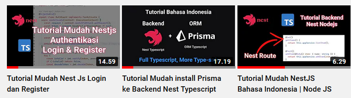
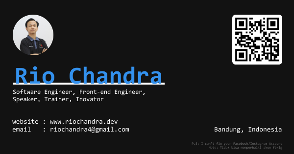

  

## Nest Js Tutorial Starter

Repository nestjs starter untuk memulai belajar nestjs, dan menggunakan [Prisma ORM](https://www.prisma.io/) sebagai koneksi database dan Query builder ORM. Projek ini Full [Typescript](https://www.typescriptlang.org/).

## Tutorial

Projek ini secara live di tutorialkan pada video youtube

Tonton video tutorial Nestjs disini 

- [Perkenalan nestjs](https://www.youtube.com/c/RioChandra01)
- [Koneksi Nestjs ke database](https://www.youtube.com/c/RioChandra01)
- [Membuat login dan register](https://www.youtube.com/c/RioChandra01)

## Tentang Saya

